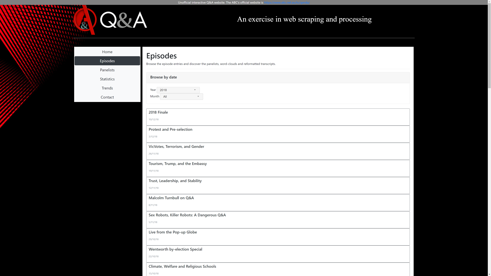
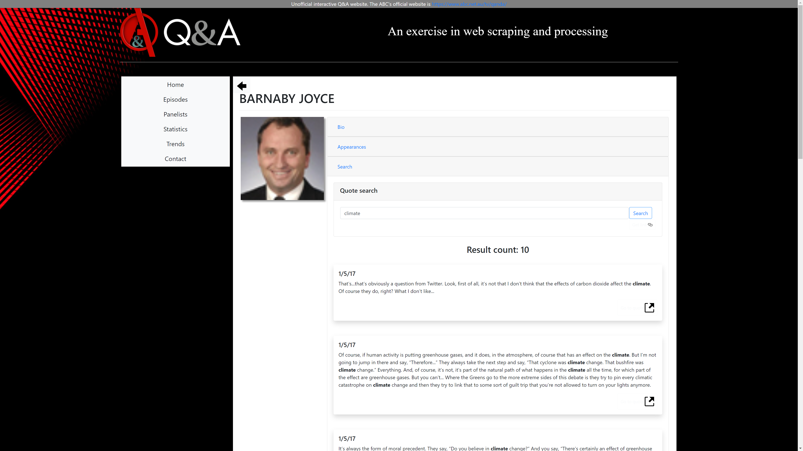
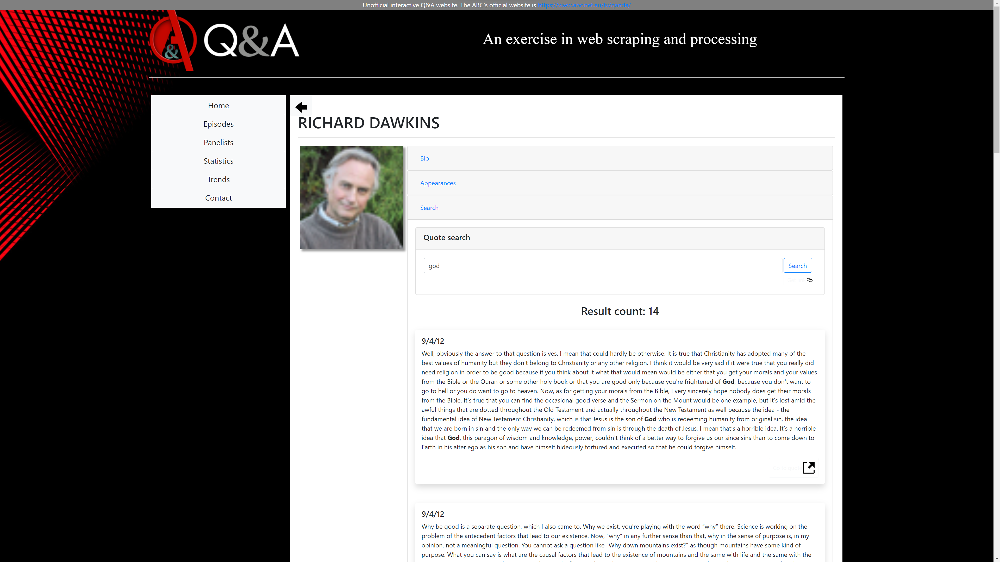
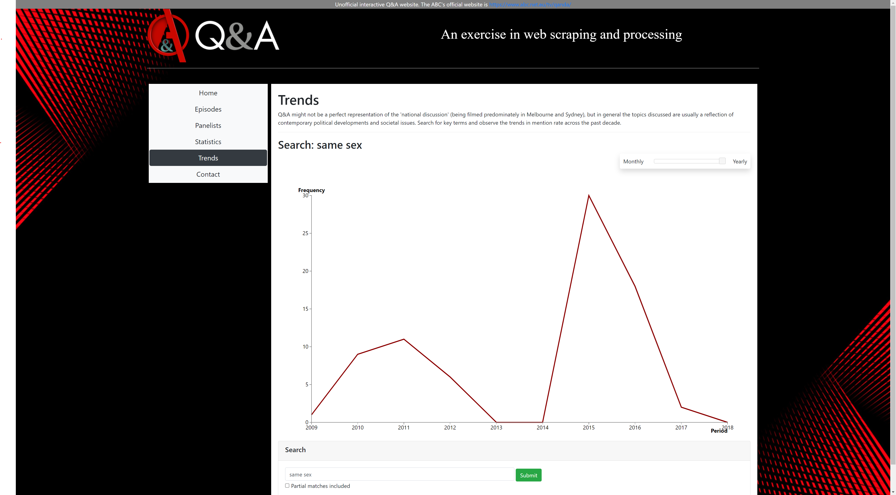

# [USE IT HERE (IN BROWSER)](https://gregorykau.github.io/Qanda-Searcher/site/qanda.html?section=home)

# ABC Q&A Transcript Searcher
<div style="width: 100%; text-align: center">
    
</div>

## NodeJS Express Web Dashboard to display Q&A transcripts & statistics between 2008-2018

This project started as my assignment submission for a data visualization unit at Monash University. The choice of tools and libraries is somewhat haphazard, as they were included based on what I was learning at the time to assist with my studies.

The transcript JSON data was generated by scraping the ABC's Q&A site. The site has since been updated, so the included scraper script will no longer function. Nontheless, the existing pre-extracted JSON data is of interest as it allows for the easy searching and attribution of quotes in the 2008-2018 period. 

Search to see what your representatives have said in the past. How consistent have they been?

## Features:

- Beautified transcript layout (put a face to the speaker's name), search through the episode archive.
- See word-clouds for each episode. 
- Browse panelists; see their bio, appearance list, and search for individual quotes (and see the context in which they were said through transcript position linking).
- See statistics summaries regarding political representation of the audience, and gender representation of both audience and panel (via tableau).
- Observe trends of word usage throughout the years and months of broadcasts.

## Usage:
- ```http-server``` in the /site directory ([install here](https://github.com/http-party/http-server)). A dummy server is used to avoid a CORS violation which would be encountered if directly opening qanda.html in the browser due to cdnjs script inclusions.
- Then simply visit localhost:8080/qanda.html

## Screenshots:













## Top most bizarre Q&A Moments:


